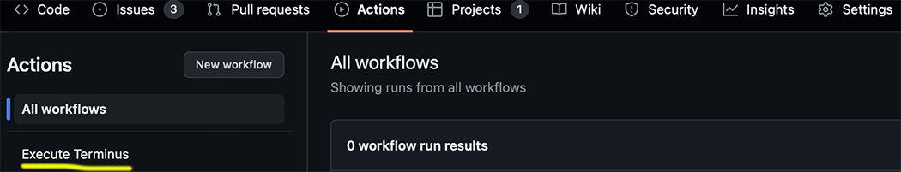
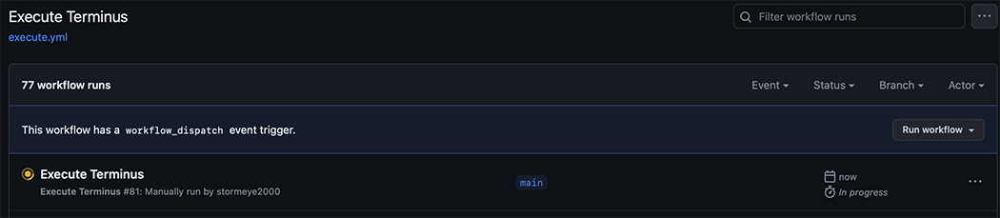
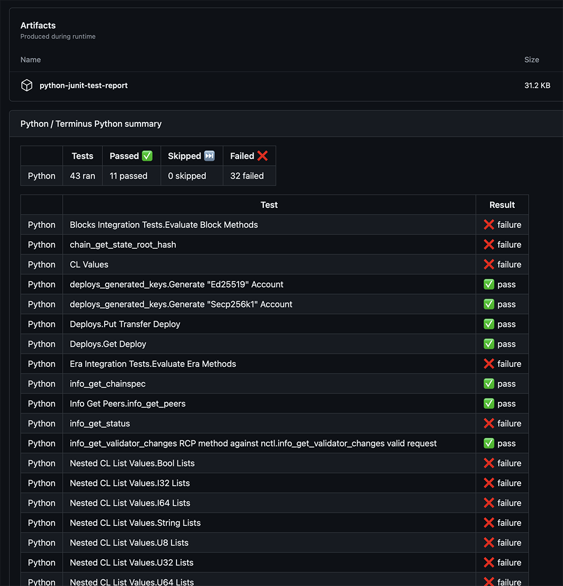

# Project Terminus

Formerly Standard SDK Tests.

This project enables the manual execution, via GitHub Actions, of individual or multiple language SDK tests.

To run the tests do the following:

Click on the Actions tab highlighted below

------

Click on Execute Project Terminus in the left hand panel highlighted below

------

On the next screen click on Run workflow.

This will then display a drop down with run options. The Node build repo option defines the branch to build the NCTL Docker image from. If the action cannot locate the Docker image in docker.io then the image will be built by the action runner. Populate the blank language SDK fields with the desired branch to test, leave blank to ignore. See the example below.

------

Clicking on Run workflow will present the following screen with the amber badge indictating the action is running

------

Clicking on the workflow will present the following screen

------

Once the job is completed, succes or failure, click on the Summary tab highlighted below

------

Scroll down on the next screen and view the run summary as below

## Notes

We are working within the limitations of GitHub's actions here. For example the dropdown menu can obnly have ten UI items. We are also using a third party action to display the test summary which has its limitations.

Work will be done to create a Casper specific test summary action in the future.