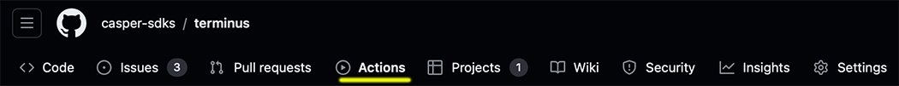

# Project Terminus

Formerly Standard SDK Tests.

This project enables the manual execution, via GitHub Actions, of individual or multiple language SDK tests.

To run the tests do the following:

Click on the Actions tab highlighted below

